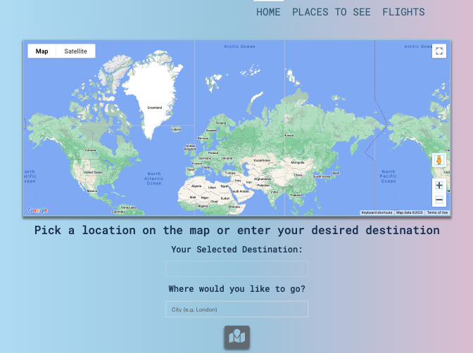

# 🗺️ Travel Planner: Let us take you there

## Overview

Welcome to Travel Planner, your go-to app for all your travel needs!
Whether you're planning a business trip, a family vacation, or a solo adventure, our app has got you covered.

With Travel Planner, you can easily book flights to your desired destination and discover exciting places of interest to visit while you're there.

We understand that planning a trip can be overwhelming, which is why we've made it our mission to simplify the process for you.
Our user-friendly interface makes it easy to find and book flights, select your preferred cabin, and choose from a variety of airlines.

But we don't just stop at flights - we also provide information on popular tourist attractions, landmarks, and hidden gems at your destination.

So, whether you're a seasoned traveler or a first-time adventurer, discover Travel Planner today and start planning your next great escape!

## Application Home Page Screenshot

## Link to application

- Check the full functionality by accessing the app on the below link:

[Travel Planner](https://travelhev.netlify.app)

## Built with...

- React

- Node.js

- Vanilla Bootstrap & React Bootstrap

- Server APIs

- Deployed using Netlify

## What we learned

- The importance of project scoping in order to develop fully functional application: in comparison to our first project we have encountered some challenges and thus some features remain unfinished

- The importance of finding the right APIs for our needs: it would have been beneficial if we spent a bit more time in deciding on which APIs to use to ensure we can render the information we need

- Outlining and establishing clear expectations for individual contributions

- Solidified React and JS skills that we've learned so far

## Directions for future development

Things for the future include:

- Fixing map marker landmarks fetch (Map is currently out of order due to API accessibility 🤑)

- Enabling functionality of searching places based on map marker location

- Add accommodations and car rentals prices and search functionality.

- More flight options, ability to filter results and show flight times as part of the search results.

- Polish UI

## Useful Resources

- [React](https://react.dev/)

- [FlightAPI](https://www.flightapi.io/)

- [AirLabs API](https://airlabs.co/)

- [OpenTripMap API](https://opentripmap.io/product)

- [Google Maps API](https://developers.google.com/maps/documentation/javascript/libraries-open-source)

- [React Bootstrap](https://react-bootstrap.github.io/)

## Authors

©️ HEV Squad 2023 (Helena, Emilie and Vinh)

- GitHub - [cyberrie](https://github.com/cyberrie)

- GitHub - [EmilieLondon](https://github.com/EmilieLondon)

- GitHub - [VinhKietLa](https://github.com/VinhKietLa)

## Acknowledgements 🌟

- Big Thanks to Andrew, Dane and Scott for helping us out with challenges during this project ✨
